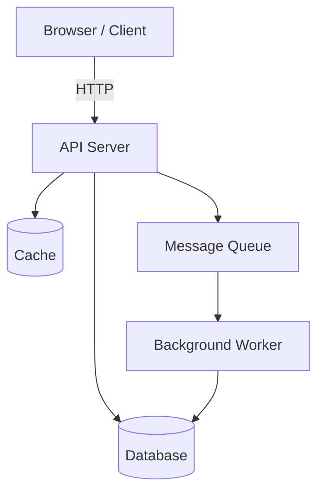
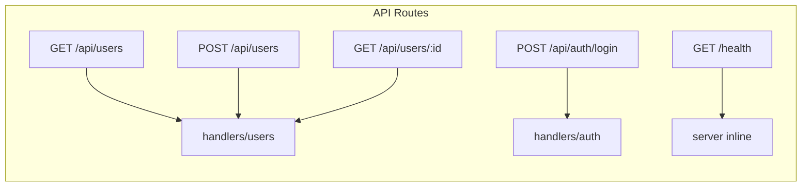
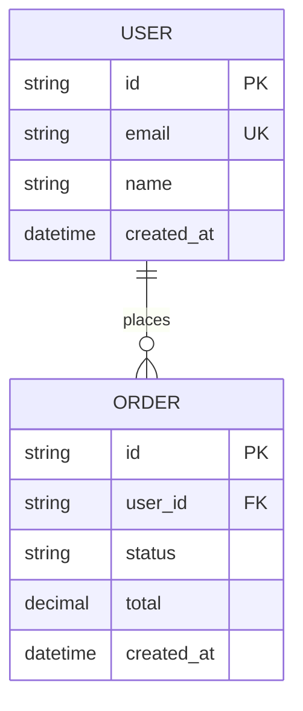

# Generate Diagram

Scan the project and generate diagrams based on what exists in the code.

**Type:** $ARGUMENTS

Available types:

- `architecture` — System overview: services, connections, data flow
- `api` — API routes map: all endpoints grouped by resource
- `data` — Data model: entities, fields, relationships
- `all` — Generate all applicable diagram types

If `--update` is passed, write to `docs/` directly. Otherwise, show the diagram and ask before writing.

## Diagram Format

All diagrams use **Mermaid** syntax — renders in GitHub, GitLab, Notion, and most markdown editors.

---

## Type: `architecture`

Scan the project structure and generate a system overview.

### What to scan:

1. Root files to detect project type (`package.json`, `pyproject.toml`, `Cargo.toml`, `go.mod`, etc.)
2. Entry points — find main files, server files, app files
3. Service/module boundaries — identify distinct components
4. External service calls — HTTP clients, database connections, message queues

### Generate the diagram:



**Adapt this to what ACTUALLY exists.** Do not include services that don't exist. Only diagram what you found in code.

### Where to write:

`@docs/ARCHITECTURE.md` — replace or create the `## System Overview` section.

---

## Type: `api`

Scan route definitions and generate a routes map.

### What to scan:

```bash
# Express/Fastify/Hono
grep -rn "app\.\(get\|post\|put\|delete\|patch\)\|router\.\(get\|post\|put\|delete\|patch\)" . 2>/dev/null

# Next.js / file-based routing
find . -path "*/app/api/*/route.*" -o -path "*/pages/api/*" 2>/dev/null

# FastAPI / Flask / Django
grep -rn "@app\.\(get\|post\|put\|delete\|patch\)\|@router\.\|path(" . 2>/dev/null

# Axum / Actix / Gin / Echo
grep -rn "\.get\|\.post\|\.put\|\.delete\|\.patch" --include="*.rs" --include="*.go" . 2>/dev/null
```

### Generate the diagram:



### Where to write:

`@docs/ARCHITECTURE.md` — add or replace `## API Routes` section.

---

## Type: `data`

Scan models, schemas, or type definitions to map the data model.

### What to scan:

```bash
# ORM models / schema files
find . -name "*.model.*" -o -name "models.py" -o -name "schema.prisma" \
       -o -name "*.schema.*" 2>/dev/null

# Type definitions
grep -rn "class\|struct\|interface\|type.*=" --include="*.py" --include="*.rs" \
     --include="*.ts" --include="*.go" . 2>/dev/null | head -40
```

### Generate the diagram:



### Where to write:

`@docs/ARCHITECTURE.md` — add or replace `## Data Model` section.

---

## Type: `all`

Run all applicable types in sequence: architecture → api → data.

---

## File Path References

When referencing files in generated documentation, use `@path/to/file` syntax for absolute paths (e.g. `@src/models/user.ts`). Relative or fuzzy references (e.g. `models/user.ts`) are fine as-is.

## After Generating

1. Show the generated diagram(s) to the user
2. If `--update` was passed: write directly to `docs/`
3. If not: ask "Write this to docs/ARCHITECTURE.md?" before writing
4. Report what was generated:

```
Diagrams Generated
==================
- Architecture — 3 components found
- API Routes — 12 endpoints across 4 resources
- Data Model — 5 entities, 4 relationships

Written to: docs/ARCHITECTURE.md
```
