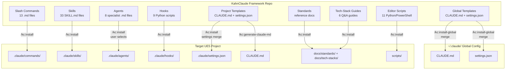
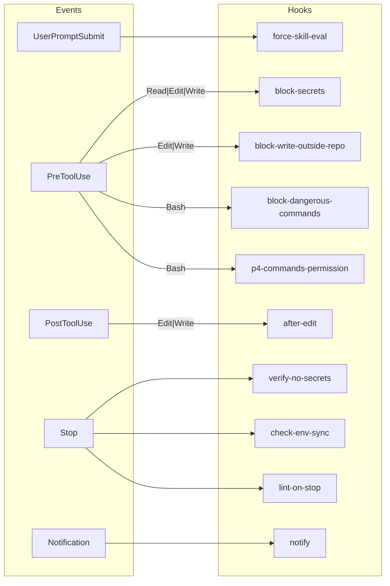
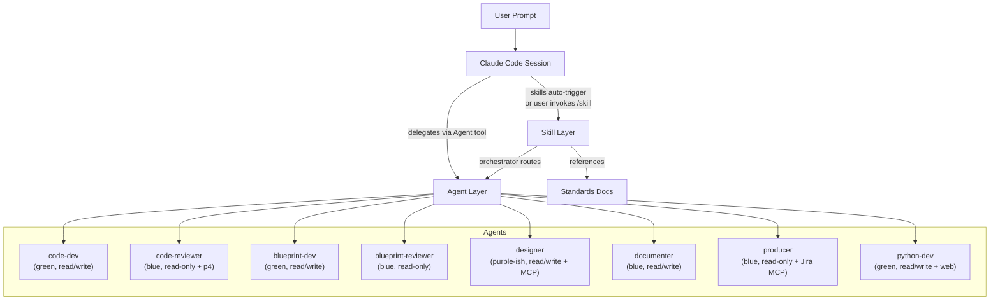

# Architecture -- KahnClaude Framework

KahnClaude is a **Claude Code configuration layer** for UE5 + Perforce + Jira game development. It is not a runnable application -- it provides slash commands, specialist agents, enforcement hooks, skills, editor scripts, and CLAUDE.md templates that are installed into target projects via `/kc:install`.

---

## System Overview

---

## Component Map

| Component | Responsibility | Key Files |
|-----------|---------------|-----------|
| **Slash Commands (project)** | On-demand workflows distributed to target projects | `@.claude/commands/*.md` (6 files: answer, document, explain, learn, progress, refactor) |
| **Slash Commands (framework)** | KahnClaude management -- never distributed | `@.claude/commands/kc/*.md` (7 files: install, install-global, update, import, create-agent-skill, fix-agent-skill, generate-claude-md) |
| **Skills** | Focused auto-triggered + user-invokable workflows organized by theme | `@.claude/skills/<name>/SKILL.md` (33 skills across code, perforce, swarm, jira, confluence, planning, unreal, tools themes) |
| **Agents** | Specialist subagents with restricted tool access | `@.claude/agents/core/*.md` (8 agents: code-dev, code-reviewer, blueprint-dev, blueprint-reviewer, designer, documenter, producer, python-dev) |
| **Hooks** | Deterministic Python enforcement scripts at lifecycle points | `@.claude/hooks/*.py` (9 scripts: block-secrets, block-write-outside-repo, block-dangerous-commands, p4-commands-permission, verify-no-secrets, check-env-sync, after-edit, notify, lint-on-stop) |
| **Settings (framework)** | Hook wiring and permissions for this repo | `@.claude/settings.json` |
| **Settings (project template)** | Hook wiring and permissions for target projects | `@project/settings.json` |
| **Project Template** | Master CLAUDE.md template for auto-generation | `@project/CLAUDE.md` |
| **Standards** | Shared review criteria and reference docs loaded by skills and agents | `@project/docs/standards/` (subdirs: code, perforce, swarm, jira, confluence, planning, unreal, vs, tools, python, design) |
| **Tech-Stack Guides** | Q&A guides for CLAUDE.md generation per detected technology | `@project/docs/tech-stacks/` (6 guides: unreal, helix_perforce, helix_swarm, atlassian_jira, atlassian_confluence, visual_studio) |
| **Editor Scripts** | Python/PowerShell automation for UE5 editor and Visual Studio | `@project/scripts/unreal/` (asset-inspections, PIE, compile) and `@project/scripts/vs/` (launch, debug) |
| **Global Templates** | Cross-project config installed to ~/.claude/ | `@global/CLAUDE.md`, `@global/settings.json` |
| **Inspiration** | Read-only third-party reference projects -- never modified | `inspiration/` |

---

## Technology Choices

| Decision | Choice | Why |
|----------|--------|-----|
| Primary content format | Markdown with YAML frontmatter | Claude Code natively parses `.md` commands, skills, and agents; frontmatter carries metadata (name, description, scope, tools) |
| Hook language | Python (stdlib only) | Cross-platform (Windows, WSL, macOS, Linux); no shell quoting edge cases; easy to test; no external dependencies |
| Editor scripts | Python + PowerShell | Python for UE5 Remote Execution (asset inspection, PIE); PowerShell for Windows COM/DTE automation (Visual Studio, UE5 editor launch) |
| Enforcement model | Three layers: .p4ignore > Hooks > CLAUDE.md rules | Hooks are deterministic (exit code 2 = block); CLAUDE.md rules are behavioral suggestions that can be overridden by the LLM under context pressure |
| Skill activation | Directive descriptions ("ALWAYS invoke when...") | Research showed ~100% activation vs ~50% for passive descriptions ("Use when...") |
| Skill architecture | Orchestrator + concern-based review | `code-review` orchestrator spawns parallel agents for 7 concern categories (Architecture, Correctness, Security, Performance, Maintainability, Reuse, Standards) based on diff content |
| Agent tool restriction | Minimum-necessary principle | Reviewers get Read/Grep/Glob only; developers get Write/Edit/Bash; prevents accidental modification during review |
| Distribution model | `/kc:install` copies files + merges settings | Non-destructive install; manifest tracks source commit for `/kc:update`; global config merges via `/kc:install-global` |
| Hook lifecycle events | 5 events: UserPromptSubmit, PreToolUse, PostToolUse, Stop, Notification | Maps to Claude Code's native hook system; exit code semantics: 0=allow, 1=warn, 2=block |
| Standards location | `project/docs/standards/` for multi-consumer; inline in agent for single-consumer | Avoids duplication; skills reference via `@docs/standards/` paths |
| Version control target | Perforce (Helix Core) with Streams | Framework is specialized for UE5 game dev; Perforce is the standard VCS for Unreal projects |

---

## Skill Theme Map

Skills are organized into themes, each with a set of SKILL.md files and corresponding standards docs.

| Theme | Skills | Standards Path | Description |
|-------|--------|---------------|-------------|
| **code** | 1 (code-review orchestrator) | `@project/docs/standards/code/` | Code review orchestration with 7 concern categories; standards files for interface, networking, UE5 best practices |
| **perforce** | 2 (changelog, changelist-description) | `@project/docs/standards/perforce/` | Changelog generation and CL description formatting |
| **swarm** | 2 (review-shelve, review-comments) | `@project/docs/standards/swarm/` | Helix Swarm code review integration |
| **jira** | 1 (to-jira-issue) | `@project/docs/standards/jira/` | Jira issue creation and update |
| **confluence** | 1 (to-confluence-page) | `@project/docs/standards/confluence/` | Confluence page creation, update, and game wiki publishing |
| **planning** | 1 (task-planning) | `@project/docs/standards/planning/` | Requirements clarification, implementation planning, architecture review |
| **unreal** | 5 (compilation, game-log, PIE, asset-inspections, editor-python) | `@project/docs/standards/unreal/` | UE5 editor automation, build, and diagnostics |
| **tools** | 4 (skill-creation, agent-creation, skill-improvement, agent-improvement) | `@project/docs/standards/tools/` | KahnClaude meta-tooling for creating and fixing components |
| **implementation** | 1 (task-implementation) | -- | Unified orchestrator routing to code-dev and blueprint-dev agents |

---

## Hook Wiring

Hooks are wired in `@.claude/settings.json` (framework) and `@project/settings.json` (distributed to projects). The framework repo wiring differs slightly from the global template in `@global/settings.json`.

**Note:** `force-skill-eval` is referenced in `@README.md` but does not yet exist as a file in `@.claude/hooks/`. The `block-write-outside-repo` hook exists as a file but is not wired in the framework `settings.json` -- it is wired in the global template `@global/settings.json`.

---

## Agent Delegation Model

---

## Installation Flow

Two installation paths exist:

1. **`/kc:install <project-path>`** -- copies commands, skills, agents (user-selected), hooks, docs, scripts, and settings into a target project. Writes a manifest to `<target>/.claude/.kahnclaude` tracking source commit for later `/kc:update`.

2. **`/kc:install-global`** -- merges `@global/CLAUDE.md` and `@global/settings.json` into `~/.claude/` without overwriting existing content. One-time setup.

---

## Subsystem Links

No subsystem docs exist yet. Use `/document <subsystem>` to create deep-dives for specific areas such as hooks, skills, agents, or the install system.

---

## References

- `@CLAUDE.md` -- framework rules, structure, and code style
- `@README.md` -- full component listing, quick start, and usage guide
- `@CONTRIBUTING.md` -- conventions for adding commands, skills, agents, hooks, and standards
- `docs/decisions.md` -- decisions log (referenced from CLAUDE.md; not yet created)
